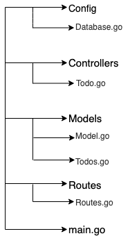

><b>List of Packages we are going to use</b>
```
go get github.com/go-sql-driver/mysql
go get github.com/gin-gonic/gin
go get github.com/jinzhu/gorm
```

> <b>Project Structure</b>



> <b>List of APIs</b>
```
GET: /v1/todo 
POST: /v1/todo
GET: /v1/todo/:id
PUT: /v1/todo/:id
DELETE: /v1/todo/:id
```

> Table and Schema

* Table Name: todo
* Table Attributes: id, title, description
